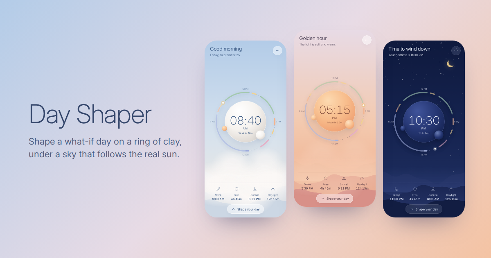

# Day Shaper

Shape a what-if day on a ring of clay, under a sky that follows the real sun.

**Live:** https://day-shaper-psi.vercel.app · **Design system:** [`/design-system/`](design-system/)



## Two states of one object

**Living the day.** The screen is one moment: the sky is painted for this minute from the real sunrise and
sunset, a single orb holds the time, and a slim dotted ring shows the shape of your day. The orb takes the
material of what you're doing: porcelain when you're free, a warm sun at golden hour, night glass after dark,
and the clay of the block you're in, gently breathing. The words are specific: *Focus · Until 12:30 PM*,
*Time to wind down · Your bedtime is 11:30 PM*, *Almost there · Dawn is 2h 15m away.*

**Shaping the day.** Tap the dial (or *Shape your day*). The ring swells into clay, the orb settles into a hub,
and five stones rise from the bottom.

| Gesture | What happens |
| --- | --- |
| Tap a stone | Adds it at the next free stretch after now that fits |
| Drag a stone onto the ring | Previews the whole cascade live, places it where you let go |
| Drag a block | Moves it; neighbours are pushed on contact and spring back if you retreat |
| Drag a block's end | Stretches or shrinks it (15-minute steps) |
| Drag a block into the orb | Removes it |
| Turn the orb | Shifts the whole day together |
| Tap a block | Selects it: the orb shows its span and length |
| Undo (toast, ⌘/Ctrl-Z) | Steps back through the last 60 changes |

Keyboard: focus a block with Tab, then use ←/→ to move it, Shift+←/→ for its end, Alt+←/→ for its start, and
Delete to remove it. Esc deselects, then leaves shaping.

The menu (⋯) has *Play the day* (your shaped day passes in 24 seconds), *Share this day* (a link that opens
it), *Now on top*, *24-hour clock*, *True sunrise* (uses your location once, only if you ask), a sample day,
and *Clear the day*.

## Decisions worth knowing

- **The day is a ring.** Blocks can cross midnight, so sleep from 11:30 PM to 7:00 AM is one block. The first
  version couldn't do this.
- **One solver, pure.** Every edit is a function of the snapshot taken when your finger landed. The block
  under your hand is pinned; the others keep their order around the ring and settle as close to where they
  were as possible (`src/engine.js`). A property test runs 10,000 random edits and checks that nothing overlaps
  and nothing passes through anything else.
- **Dropping into a block disturbs the day as little as possible.** The engine tries both directions and
  keeps the one that moves the fewest hours.
- **Ten moments of sky, pinned to the sun.** Midnight, pre-dawn, dawn, sunrise, morning, noon, afternoon,
  golden hour, dusk, blue hour. Each is a complete atmosphere, blended in OKLab so dusk passes through violet
  instead of grey (`src/sky.js`). Ink is *chosen* by contrast, never blended; tests hold every minute of every
  sky to at least 3:1.
- **Real sun.** NOAA sunrise/sunset (`src/solar.js`), tested against published times. Without a location it
  estimates from your time zone. Polar day and night are handled.
- **No build step.** Plain ES modules, one variable font (Inter, OFL), a network-first service worker for
  offline use. Everything is stored on your device; nothing is sent anywhere.

## Run it

```sh
npm start            # serves the folder on http://localhost:8791
npm test             # unit tests (node --test): engine, sky, solar, words
npm run test:e2e     # drives the real app in Chromium (needs Playwright)
```

Useful URLs while designing:

- `?at=18:47` freezes the clock at that time
- `?preview` uses the sample day and a fixed sun and saves nothing (the design system's frames use this)
- `?shape=1` opens in shaping
- `?day=s94.30w36.14` opens a shared day (type letter, start and length in quarter hours)

## Layout

```
index.html              the shell
styles/tokens.css       design tokens (shared with the design system page)
styles/app.css          app styles
src/engine.js           the ring and its solver (pure)
src/sky.js              ten moments of sky (pure)
src/solar.js            sunrise and sunset (pure)
src/context.js          what the screen says (pure)
src/time.js, color.js   formatting, OKLab
src/types.js            the five clays
src/store.js            storage, undo history, share links
src/scene.js            paints the sky, ridges, clouds, stars, moon, low sun
src/dial.js             the dial: live ring ↔ clay ring, orb, labels
src/main.js             state, gestures, frame loop
design-system/          the design system, built from the same files
test/                   unit tests and the end-to-end smoke test
```
