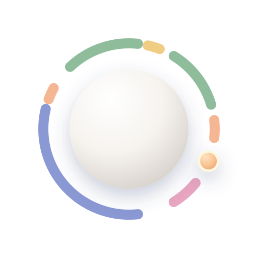
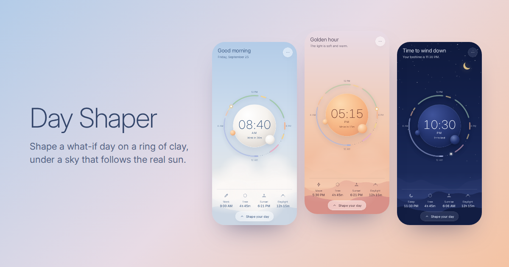

<p align="center"></p>

# Dayshaper

Shape your day on a ring of clay, under a sky that follows the sun.

**[Open Dayshaper](https://dayshaper.burooj.dev)** · [Design system](https://dayshaper.burooj.dev/design-system/)



A small, tactile day planner. Stretch time, move things around, and see how a different day feels. The sky follows the daylight, the moon follows its phase, and the orb takes on the colour of what you're doing now.

No account. Your day stays in your browser. Install it on your home screen and use it offline after the first visit.

## Shape a day

Tap **Shape your day**. Five clay stones give you somewhere to start: sleep, focus, food, movement, and rest. Name any block to make it yours.

| Action | How |
| --- | --- |
| Add time | Tap a stone, or drag it onto the ring |
| Move a block | Drag it; neighbouring blocks make room |
| Change its length | Drag either edge in 15-minute steps |
| Reorder | Pull a block off the ring, then drop it somewhere else |
| Remove | Drag a block into the orb |
| Rename | Select a block, then tap the orb |
| Shift the whole day | Turn the orb |
| Finish | Tap Done or the sky outside the ring |
| Undo | Use the toast or ⌘/Ctrl-Z |

The ring crosses midnight, so a night's sleep stays one block. The round button beside **Shape your day** switches between noon and now at the top. In the menu, **Play the day** runs through it in 24 seconds; **Share this day** makes a link containing the schedule, including your block names.

**Keyboard:** Tab to a block. ←/→ moves it; Shift+←/→ changes its end; Alt+←/→ changes its start. Enter renames, Delete removes, and Esc deselects or leaves shaping.

## Install

Open the menu and choose **Install Dayshaper**. Supported browsers offer installation directly. On iPhone or iPad, open the site in Safari and use **Share → Add to Home Screen**. Your installed copy uses the same day saved by that browser.

The app works offline once its files have been cached. Fresh weather needs a connection.

## Location and privacy

The sun starts with an estimate from your time zone. **Where you are** asks for your location to calculate more accurate sunrise and sunset times and show the weather.

- The schedule and preferences are saved on your device. There is no account or server-side schedule storage.
- Weather comes from [Open-Meteo](https://open-meteo.com/). This request sends coordinates rounded to about a kilometre; weather is refreshed at most every 30 minutes during normal use.
- Nearby rivers, lakes, and terrain are matched on your device against bundled [Natural Earth](https://www.naturalearthdata.com/) data. This describes major physical features, not every local landform. The map is cached with the app for offline use (about 1.9 MB before compression). Coordinates are the fallback where coverage is sparse.
- A shared link contains the day's blocks and their names, but not your location. Anyone with the link can read that schedule.

**Moving from the old Vercel URL?** Open your saved day there, choose **Share this day**, and change only the hostname in the copied link to `dayshaper.burooj.dev`. Browser storage belongs to each domain, so it cannot move automatically.

## Run locally

Requires Node.js 20 or later. The app is plain HTML, CSS, SVG, and JavaScript modules; there is no build step.

```sh
npm start                         # http://localhost:8791
npm test                          # engine, sky, solar, moon, weather, geography
npm install --no-save playwright@1.56.1
npx playwright install chromium   # add --with-deps on a fresh Linux machine
npm run test:e2e                   # browser tests; starts its own server
```

Preview tools: `?preview&at=18:47` freezes a sample day without saving it; add `&shape=1` to open shaping. `?wx=rain&temp=12` previews weather. The [design system](design-system/) uses the same app files and tokens.

## Inside

- `src/engine.js` — the circular schedule solver; edits push neighbours without overlaps.
- `src/sky.js`, `solar.js`, `moon.js`, `weather.js` — light, astronomy, and conditions.
- `src/geography.js` and `data/` — nearby physical features, matched locally.
- `src/scene.js`, `dial.js`, `main.js` — rendering, state, and gestures.
- `src/store.js` — persistence, undo, and share links.
- `styles/` — shared tokens and app styles.
- `sw.js`, `manifest.webmanifest` — offline caching and installation.

`node scripts/render-brand.mjs` regenerates the logo exports, install icons, and social card from the SVGs and actual app screens (requires Playwright). Map data can be regenerated with `python3 scripts/build-geography.py`; provenance and third-party credits are in [THIRD_PARTY.md](THIRD_PARTY.md).

Made by [Burooj](https://burooj.dev).
